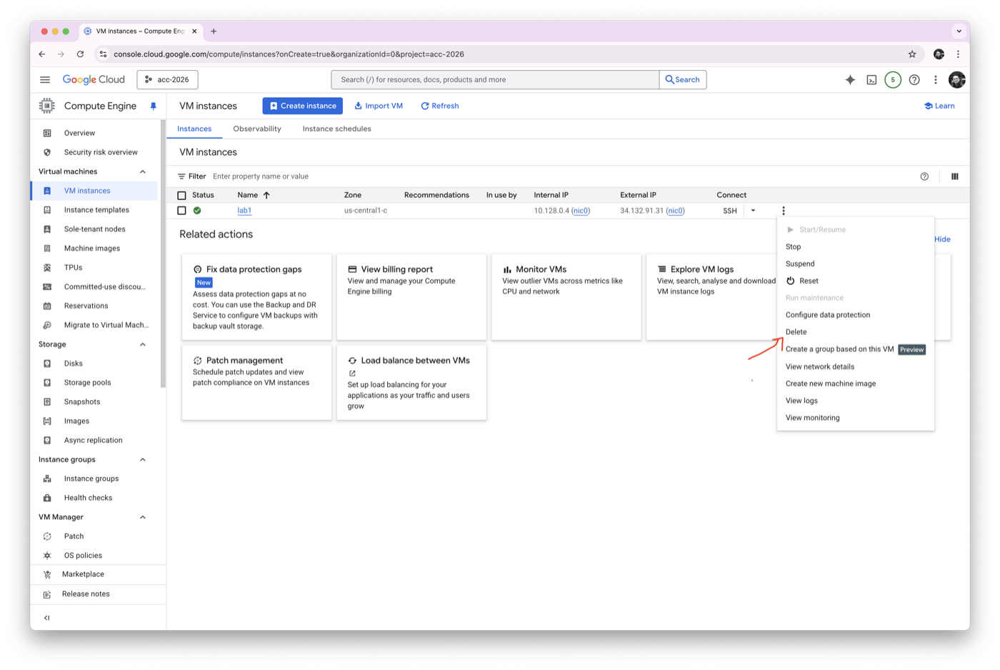

### Week 0 Part 2: Python Virtual Environment

In future weeks, we will build APIs using Python and FastAPI. For now, we will only prepare a small Python workspace and install two packages.

Complete [Part 1](c0-01-part-1.md) before starting this part. You need to be connected to your `lab-0` VM using SSH.

#### What You Will Learn

- What a Python virtual environment is.
- What `requirements.txt` is.
- How to create and activate `.venv`.
- How to install `fastapi` and `uvicorn`.
- How to delete the VM when you finish.

#### What Is a Virtual Environment?

A virtual environment is a private Python setup for one project.

It keeps the packages for this project separate from other Python projects on your computer or VM. This matters because different projects may need different package versions.

We usually name the virtual environment folder:

```text
.venv
```

The dot at the start keeps the folder hidden in many file browsers, which helps keep the project folder tidy.

#### What Is `requirements.txt`?

`requirements.txt` is a simple text file listing the Python packages a project needs.

For example, if a project needs FastAPI, we can write that package name in `requirements.txt`. Then anyone can install the same packages with one command.

#### Part A: Create the Environment

1. Update your VM package list:

```bash
sudo apt update
```

2. Install the Python tools needed for virtual environments:

```bash
sudo apt install python3-venv python3-pip
```

3. Create a folder for your first API workspace:

```bash
mkdir week0-fastapi
cd week0-fastapi
```

4. Create a virtual environment:

```bash
python3 -m venv .venv
```

5. Activate the virtual environment:

```bash
source .venv/bin/activate
```

When it is active, you should see `(.venv)` at the start of your terminal line.

#### Part B: Install FastAPI and Uvicorn

6. Create a `requirements.txt` file:

```bash
pico requirements.txt
```

Add these two lines:

```text
fastapi
uvicorn
```

Save and exit:

- Press `Ctrl + S` to save.
- Press `Ctrl + X` to exit.

7. Install the packages:

```bash
python -m pip install -r requirements.txt
```

#### What Did We Install?

- `fastapi` is the Python framework we will use to build APIs.
- `uvicorn` is the server that runs a FastAPI application.
- `pip` is Python's package installer.

8. Check that the packages installed:

```bash
python -m pip list
```

You should see `fastapi` and `uvicorn` in the list.

9. When you finish, deactivate the virtual environment:

```bash
deactivate
```

> [!TIP]
>
> Why do we install packages inside `.venv` instead of installing everything globally?
>
> <details>
> <summary>Show answer</summary>
>
> A virtual environment keeps each project's packages separate. This helps avoid version conflicts between projects.
>
> </details>

#### Part C: Delete the VM

10. When you finish, delete the VM.

   Go to **Compute Engine > VM instances**, select the `lab-0` VM, and delete it.



> [!WARNING]
>
> Do not leave cloud resources running when you are not using them. Running resources can spend your coupon credit.

#### Completion Checklist

Before Week 1, make sure you have:

- Redeemed your GCP coupon.
- Created a GCP project.
- Created an Ubuntu VM called `lab-0`.
- Connected to the VM using SSH.
- Run the `ls` command.
- Created and activated a Python virtual environment.
- Created a `requirements.txt` file.
- Installed `fastapi` and `uvicorn`.
- Deleted the VM.

