### Week 5 Part 1: GCP Coupon and First Virtual Machine

Welcome to the cloud part of the module.

In Weeks 1 to 4, you built APIs locally. Now you will prepare a cloud VM so you can run those kinds of applications outside your own computer.

#### What You Will Do

- Request and redeem your GCP coupon.
- Create a GCP project.
- Enable Compute Engine.
- Create an Ubuntu virtual machine.
- Allow web traffic to the VM.

#### Part A: Redeem Your GCP Coupon

1. In Moodle, open the **Preparation** tile.

2. Click the **Student Coupon Retrieval Link**.

3. Complete the form using your **Birkbeck email address**.

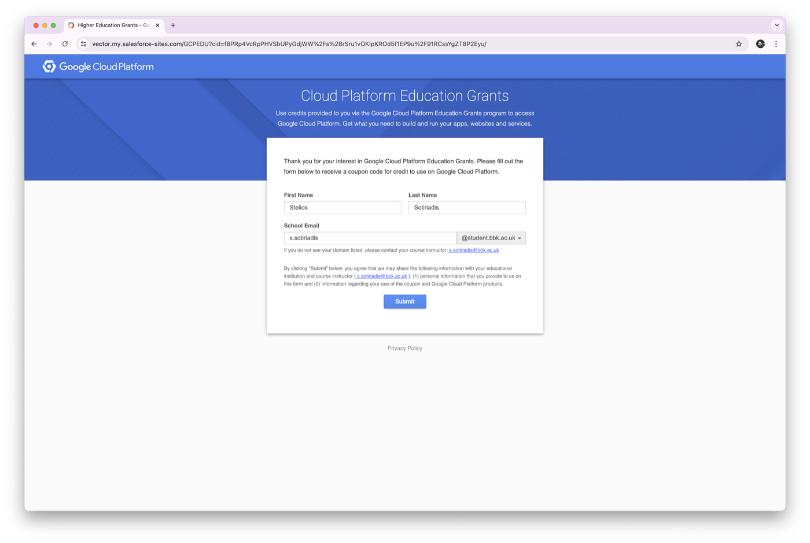

4. Check your inbox and verify your account.

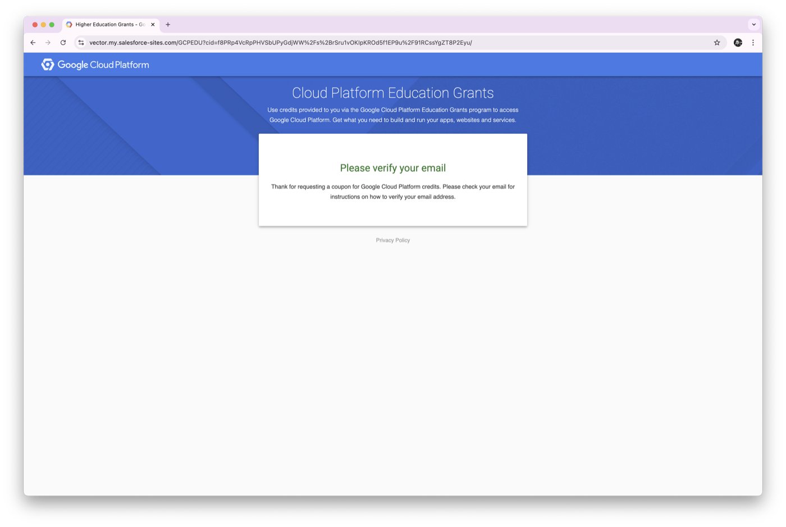

5. Wait for the second email containing your coupon code.

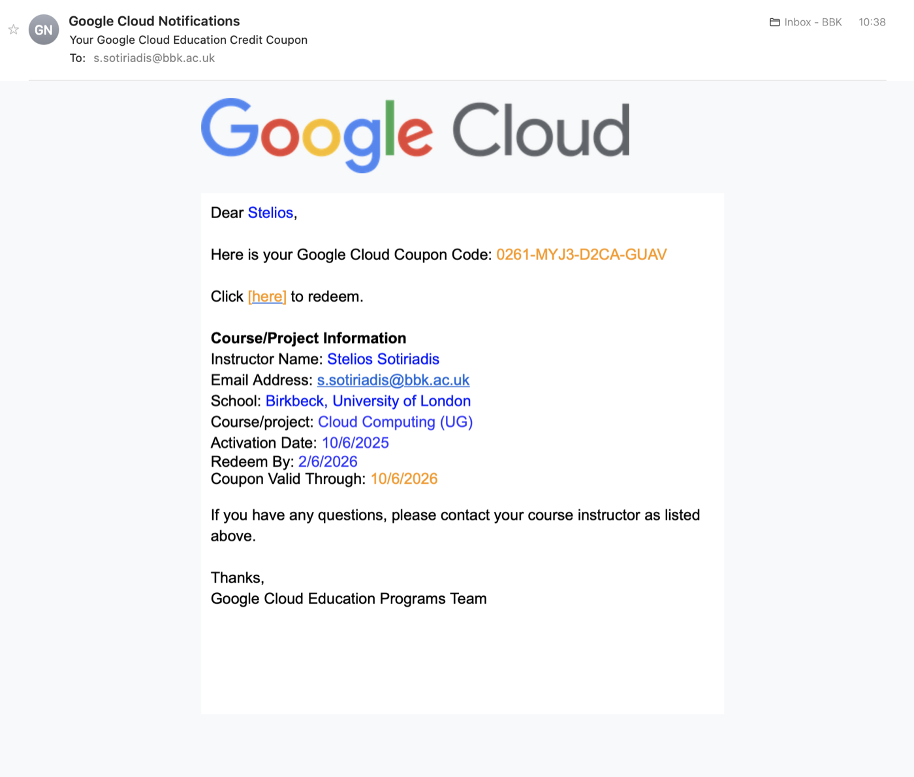

> [!IMPORTANT]
>
> Use your Birkbeck email only for the coupon request form.
>
> **Redeem the coupon with a personal Gmail account.** Do not redeem it with a Birkbeck, work, or organisation Google account.

6. Enter the coupon code and click **Accept and continue**.

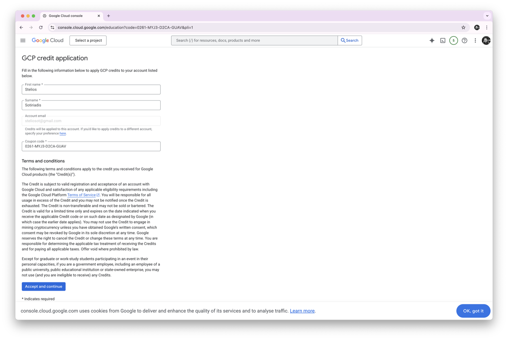

#### Part B: Create a GCP Project

7. In the GCP Console search bar, search for **Compute Engine**.

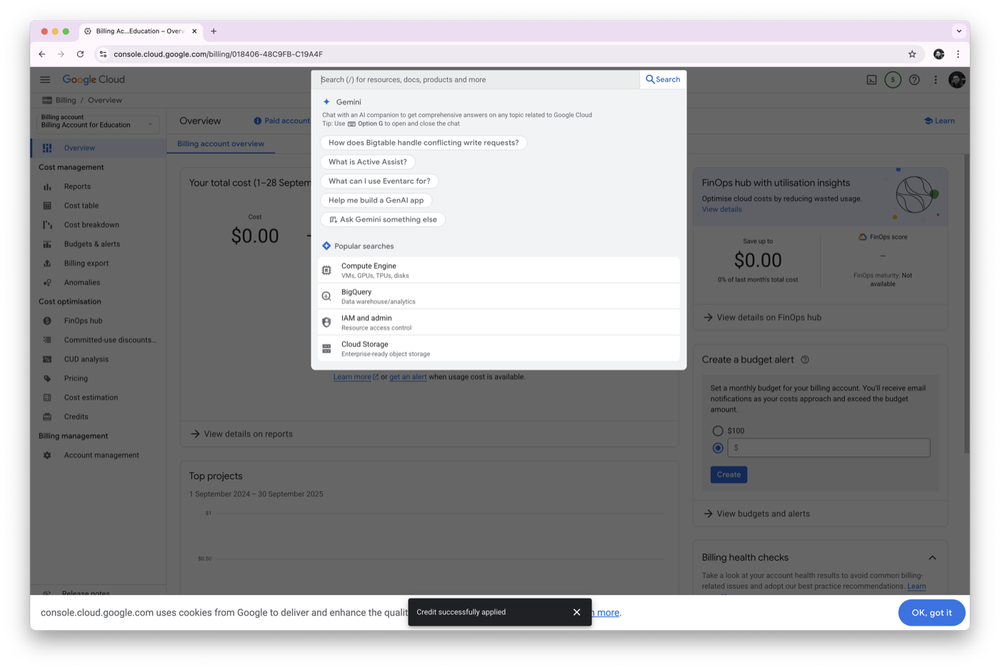

8. Click the project selector at the top-left of the page, then choose **New Project**.

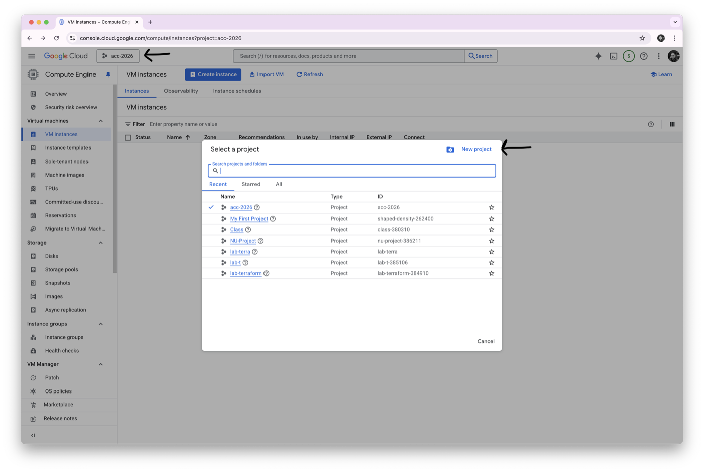

9. Give your project a clear name.

Suggested format:

```text
cc-2026-yourname
```

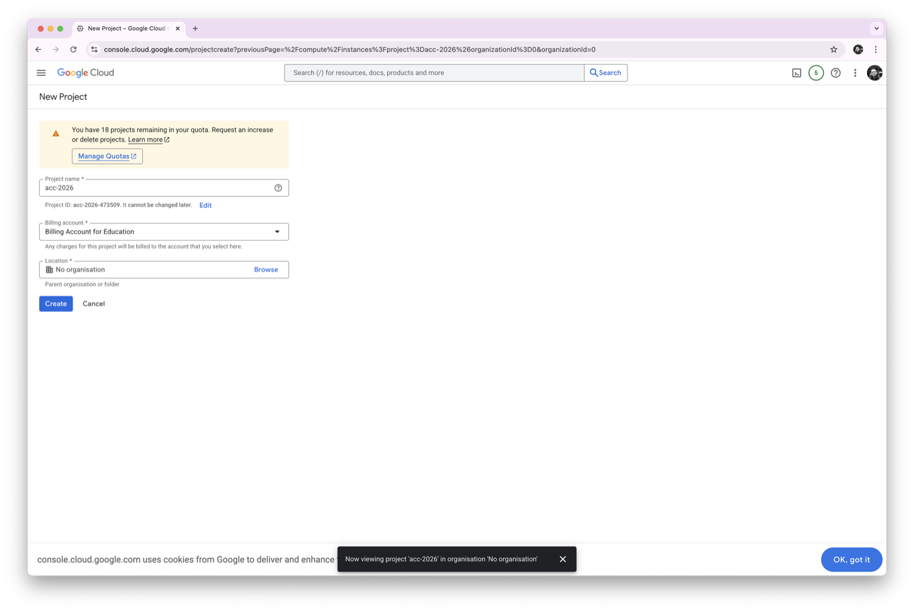

#### Part C: Create Your First VM

10. Return to **Compute Engine** and select **VM instances** from the sidebar.

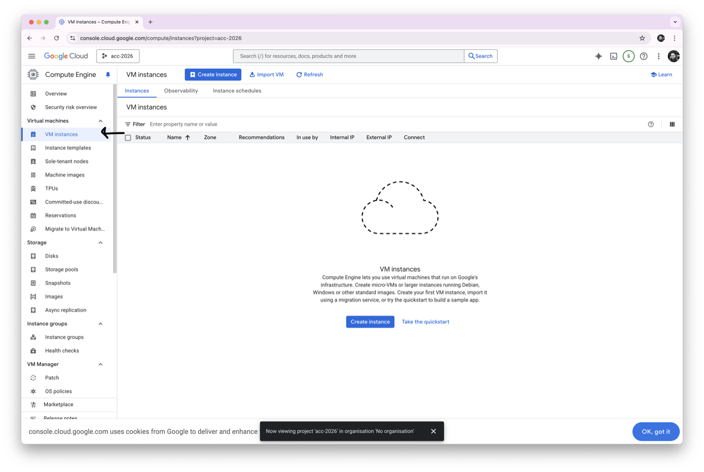

11. Click **Create instance**.

If GCP asks you to enable the Compute Engine API, click **Enable** and wait until it finishes.

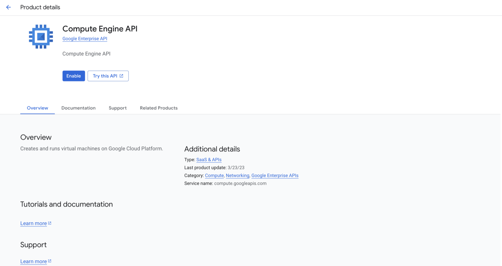

> **Quick question**
>
> Why do we need Compute Engine for this lab?
>
> <details>
> <summary>Show answer</summary>
>
> Compute Engine is the GCP service that lets us create and run virtual machines.
>
> </details>

12. Create a VM and name it:

```text
lab-5
```

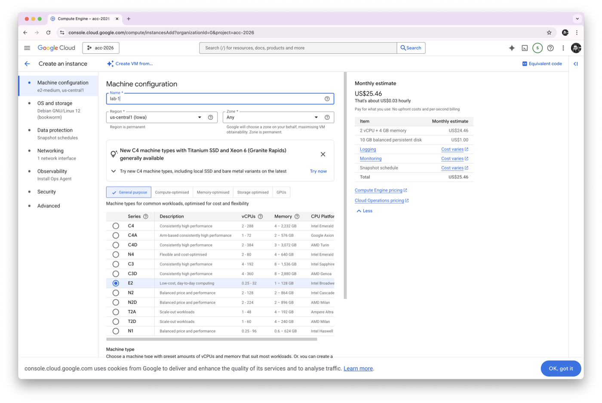

13. Under **OS and storage**, click **Change**.

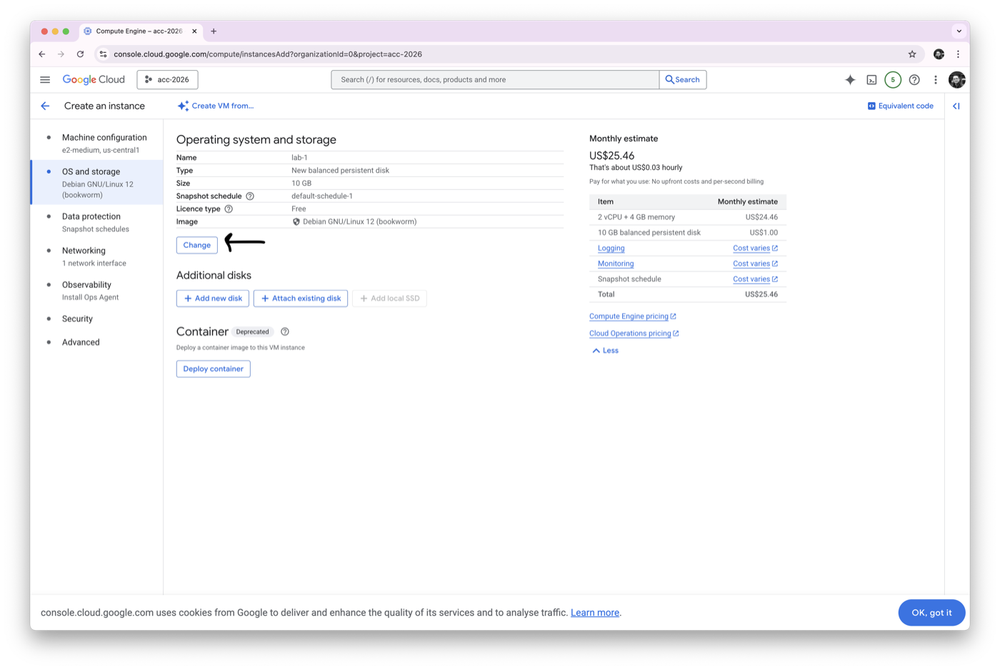

14. Choose **Ubuntu** as the operating system.

Use the closest available Ubuntu version if the exact screen looks different.

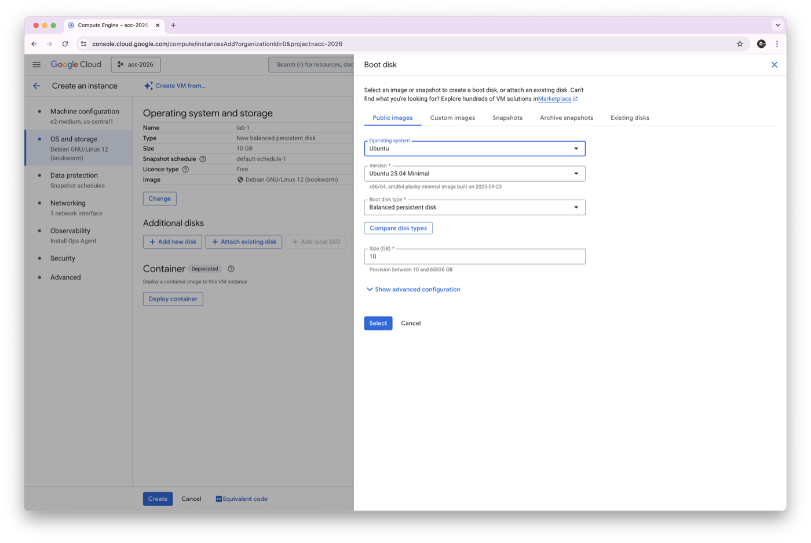

15. Open the **Networking** section and enable both:

- **Allow HTTP traffic**
- **Allow HTTPS traffic**

Then click **Create**.

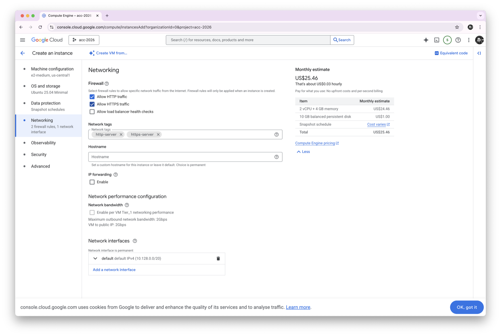

16. Wait until the VM is ready.

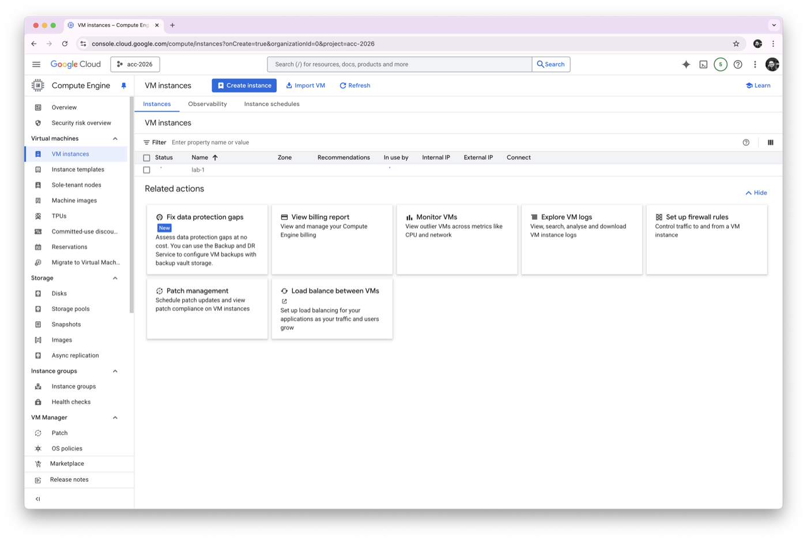

#### Part D: Stop and Check

17. In the VM instances table, find:

```text
lab-5
```

18. Copy or note the **External IP**. You will need it in later labs.

Part 1 is complete. Keep the VM running and continue to [Part 2](part-2.md).
