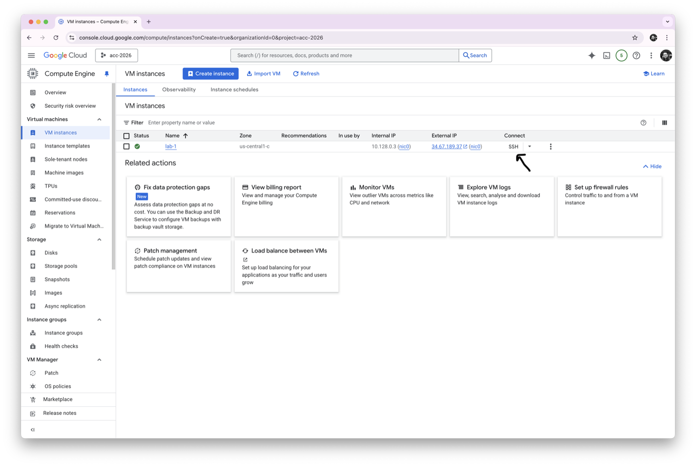
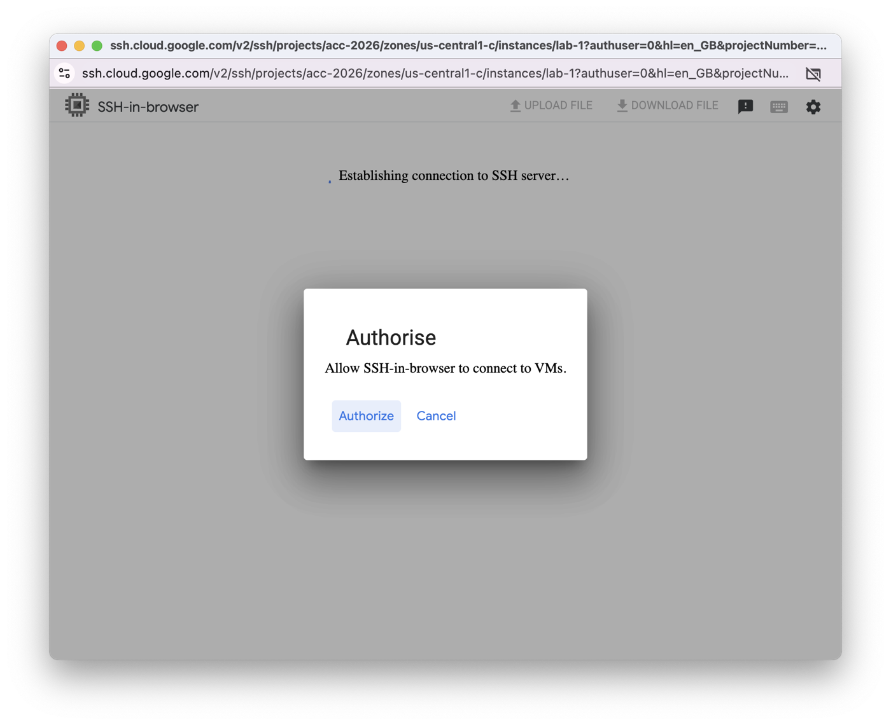
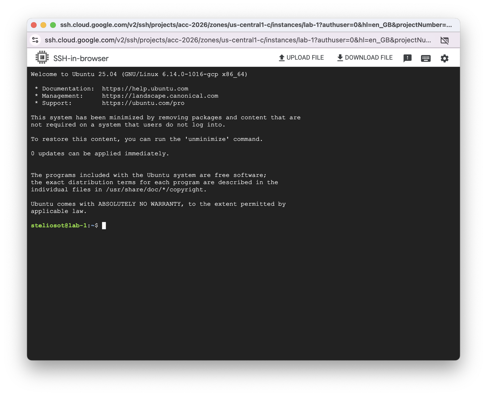

### Week 5 Part 2: SSH, Lab User, and Sudo

In this part, you will connect to your VM and create a normal lab user.

You should not do everyday work as `root`. Instead, you work as a normal user and use `sudo` only when administrator permissions are needed.

#### What You Will Learn

- How to connect to a VM using SSH.
- How to check the current user.
- How to create a Linux user.
- How to make the user a sudo user.
- Why `sudo` matters.

#### Part A: Connect to the VM

1. In GCP, open **Compute Engine > VM instances**.

2. Find your VM:

```text
lab-5
```

3. Click **SSH**.



4. If GCP asks for permission, click **Authorize**.



5. You should now see a terminal connected to your VM.



6. Run:

```bash
whoami
```

`whoami` prints the current terminal user.

<details>
<summary>Why is `whoami` useful after switching users?</summary>

It confirms which account is running the commands. This helps avoid running commands as the wrong user.

</details>

#### Part B: Create Your Lab User

7. Create a new Linux user for the labs.

Replace `student` with a name you will remember:

```bash
sudo adduser student
```

Enter a password when prompted. The password will not appear on screen while you type.

You can press `Enter` to skip optional details such as room number and phone number. Type `Y` to confirm at the end.

8. Give the new user administrator permissions:

```bash
sudo usermod -aG sudo student
```

#### Part C: What Is a Sudo User?

A sudo user, sometimes called a sudoer, is a user who is allowed to run administrator commands by writing `sudo` before the command.

We need this because normal users should not have full administrator power all the time. With `sudo`, the user works normally most of the time, but can temporarily run important system commands when needed.

> [!TIP]
>
> Why should you be careful with `sudo`?
>
> <details>
> <summary>Show answer</summary>
>
> `sudo` runs commands with administrator privileges. A mistake can change system files, delete important data, or change who can access the VM.
>
> </details>

#### Part D: Switch to the Lab User

9. Switch to the new user.

Replace `student` with your username:

```bash
su - student
```

The `-` means you switch to the new user and move into that user's home directory.

10. Check the current user:

```bash
whoami
```

11. Check the current folder:

```bash
pwd
```

You should see something like:

```text
/home/student
```

From now on, always switch to this lab user before working on the cloud labs.

Part 2 is complete. Continue to [Part 3](part-3.md).
