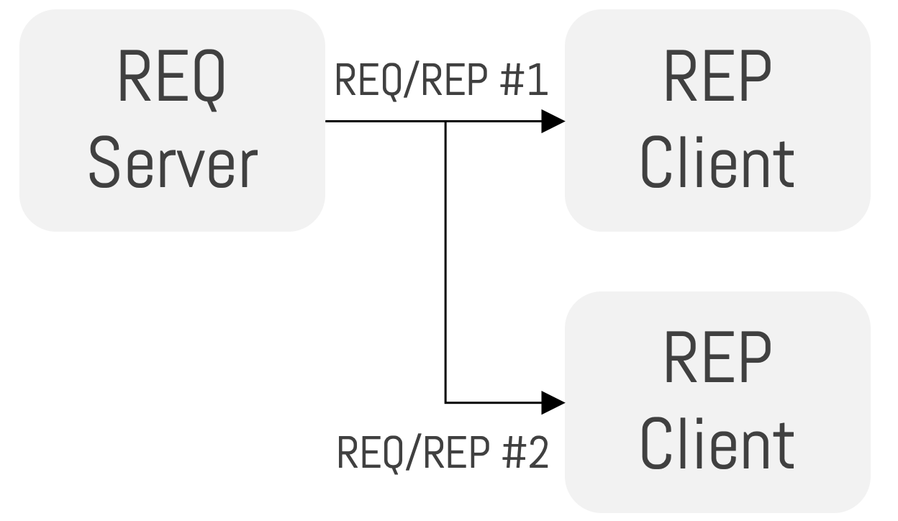
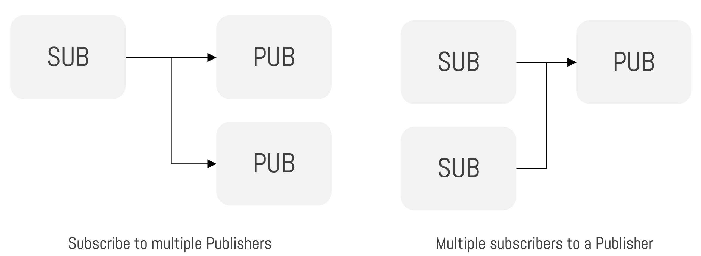
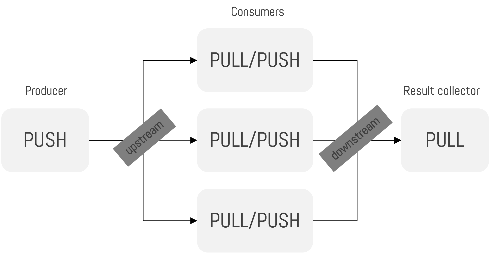

### Week 9 Lab 1: ZeroMQ Communication Patterns

In this tutorial, you will use Python and ZeroMQ to run simple distributed communication patterns.

ZeroMQ is a messaging library. It lets programs communicate using sockets without you needing to build all the low-level networking code yourself.

A socket is a communication endpoint. In this lab, all programs run on the same VM or computer, so we use `localhost` and different ports.

#### What You Will Learn

- What sockets are.
- How separate programs communicate through ports.
- How ZeroMQ Pair works.
- How ZeroMQ Request/Reply works.
- How ZeroMQ Publish/Subscribe works.
- How ZeroMQ Push/Pull works.
- How to clean up ports when testing distributed programs.

#### Communication Patterns

#### Pair


Pair communication is one-to-one. One program talks directly to one other program.

#### Request/Reply



Request/Reply is similar to a client-server API. A client sends a request, and the server must send one reply.

#### Publish/Subscribe



Publish/Subscribe lets publishers send messages without knowing exactly which subscribers will receive them.

#### Push/Pull



Push/Pull is useful for pipelines. One process pushes work, workers pull it, and another process can collect the results.

#### Part A: Prepare the Project

1. Start your GCP VM from Week 5, or use your own computer.

2. Create a new folder:

```bash
mkdir week9-zeromq
cd week9-zeromq
```

3. Create and activate a virtual environment:

```bash
python3 -m venv .venv
source .venv/bin/activate
```

On Windows PowerShell:

```powershell
python -m venv .venv
.venv\Scripts\Activate.ps1
```

4. Install ZeroMQ for Python:

```bash
python -m pip install pyzmq
```

5. Create a `requirements.txt` file:

```bash
python -m pip freeze > requirements.txt
```

6. Install `psmisc` if you are using Ubuntu and need the `fuser` cleanup command:

```bash
sudo apt update
sudo apt install -y psmisc
```

#### Part B: Pair Pattern

7. Create `pair_server.py`:

```bash
pico pair_server.py
```

8. Add:

```python
import time

import zmq

context = zmq.Context()
socket = context.socket(zmq.PAIR)
socket.setsockopt(zmq.LINGER, 0)
socket.bind("tcp://localhost:5555")

try:
    for number in range(1, 6):
        socket.send_string(f"server message {number}")
        message = socket.recv_string()
        print(f"Server received: {message}")
        time.sleep(1)
finally:
    socket.close()
    context.destroy()
```

This server creates one Pair socket.

- `zmq.Context()` creates the ZeroMQ environment.
- `zmq.PAIR` creates a one-to-one socket.
- `bind(...)` opens port `5555`.
- `send_string(...)` sends text to the client.
- `recv_string()` waits for text from the client.
- The `finally` block closes the socket when the program ends.

9. Create `pair_client.py`:

```bash
pico pair_client.py
```

10. Add:

```python
import zmq

context = zmq.Context()
socket = context.socket(zmq.PAIR)
socket.setsockopt(zmq.LINGER, 0)
socket.connect("tcp://localhost:5555")

try:
    for number in range(1, 6):
        message = socket.recv_string()
        print(f"Client received: {message}")
        socket.send_string(f"client reply {number}")
finally:
    socket.close()
    context.destroy()
```

This client connects to the server.

- `connect(...)` connects to the server port.
- The client waits for a server message first.
- Then it sends a reply.
- Pair works best when there is exactly one server and one client.

11. Open two terminals in the same folder.

12. In terminal 1, run:

```bash
python pair_server.py
```

13. In terminal 2, run:

```bash
python pair_client.py
```

Both programs should print messages and then finish.

#### Part C: Request/Reply Pattern

14. Create `rep_server.py`:

```bash
pico rep_server.py
```

15. Add:

```python
import zmq

context = zmq.Context()
socket = context.socket(zmq.REP)
socket.setsockopt(zmq.LINGER, 0)
socket.bind("tcp://localhost:5555")

try:
    for _ in range(6):
        message = socket.recv_string()
        print(f"Server received: {message}")
        socket.send_string("response from server")
finally:
    socket.close()
    context.destroy()
```

This server uses a Reply socket.

- `zmq.REP` waits for requests.
- For every request, it must send one response.
- This is similar to an API endpoint receiving a request and returning a response.

16. Create `req_client.py`:

```bash
pico req_client.py
```

17. Add:

```python
import sys
import time

import zmq

client_id = sys.argv[1]

context = zmq.Context()
socket = context.socket(zmq.REQ)
socket.setsockopt(zmq.LINGER, 0)
socket.connect("tcp://localhost:5555")

try:
    for number in range(1, 4):
        socket.send_string(f"request {number} from client {client_id}")
        reply = socket.recv_string()
        print(f"Client {client_id} received: {reply}")
        time.sleep(1)
finally:
    socket.close()
    context.destroy()
```

This client uses a Request socket.

- `zmq.REQ` sends requests.
- A Request socket must receive a reply before it sends the next request.
- We pass a client ID from the command line so we can run two clients.

18. Open three terminals.

19. In terminal 1, run:

```bash
python rep_server.py
```

20. In terminal 2, run:

```bash
python req_client.py 1
```

21. In terminal 3, run:

```bash
python req_client.py 2
```

The server should receive six requests in total.

#### Part D: Publish/Subscribe Pattern

22. Create `pub_server.py`:

```bash
pico pub_server.py
```

23. Add:

```python
import sys
import time

import zmq

port = int(sys.argv[1])
topics = ["cloud", "database", "api", "cloud"]

context = zmq.Context()
socket = context.socket(zmq.PUB)
socket.setsockopt(zmq.LINGER, 0)
socket.bind(f"tcp://localhost:{port}")

try:
    for _ in range(20):
        topic = topics[_ % len(topics)]
        value = _ + 1
        message = f"{topic} {value} {port}"
        print(f"Publishing: {message}")
        socket.send_string(message)
        time.sleep(0.5)
finally:
    socket.close()
    context.destroy()
```

This publisher sends messages with topics.

- `zmq.PUB` creates a publisher socket.
- Each message starts with a topic such as `cloud`.
- Subscribers can filter messages by topic.
- The port comes from the command line, so we can run two publishers.

24. Create `sub_client.py`:

```bash
pico sub_client.py
```

25. Add:

```python
import sys

import zmq

ports = sys.argv[1:]

context = zmq.Context()
socket = context.socket(zmq.SUB)
socket.setsockopt(zmq.LINGER, 0)

for port in ports:
    socket.connect(f"tcp://localhost:{port}")

socket.setsockopt_string(zmq.SUBSCRIBE, "cloud")

try:
    for _ in range(5):
        message = socket.recv_string()
        print(f"Subscriber received: {message}")
finally:
    socket.close()
    context.destroy()
```

This subscriber listens for selected topics.

- `zmq.SUB` creates a subscriber socket.
- `connect(...)` connects to one or more publishers.
- `SUBSCRIBE` filters messages.
- This client receives only messages that start with `cloud`.

26. Open three terminals.

27. In terminal 1, run:

```bash
python pub_server.py 5555
```

28. In terminal 2, run:

```bash
python pub_server.py 5556
```

29. In terminal 3, run:

```bash
python sub_client.py 5555 5556
```

The subscriber should receive five `cloud` messages, then finish. The publishers finish after sending twenty messages.

#### Part E: Push/Pull Pattern

30. Create `producer.py`:

```bash
pico producer.py
```

31. Add:

```python
import random
import time

import zmq

context = zmq.Context()
socket = context.socket(zmq.PUSH)
socket.setsockopt(zmq.LINGER, 0)
socket.bind("tcp://localhost:5555")

try:
    total = 0

    for _ in range(10):
        number = random.randint(1, 5)
        total += number
        task = {"number": number}
        print(f"Producer sent: {task}")
        socket.send_json(task)
        time.sleep(0.5)

    print(f"Expected final total: {total}")
finally:
    socket.close()
    context.destroy()
```

32. Create `worker.py`:

```bash
pico worker.py
```

33. Add:

```python
import random

import zmq

worker_id = random.randint(1000, 9999)

context = zmq.Context()
pull_socket = context.socket(zmq.PULL)
pull_socket.setsockopt(zmq.LINGER, 0)
pull_socket.connect("tcp://localhost:5555")

push_socket = context.socket(zmq.PUSH)
push_socket.setsockopt(zmq.LINGER, 0)
push_socket.connect("tcp://localhost:5556")

try:
    while True:
        task = pull_socket.recv_json()
        number = task["number"]
        result = {"worker": worker_id, "number": number}
        print(f"Worker {worker_id} processed: {number}")
        push_socket.send_json(result)
except KeyboardInterrupt:
    pass
finally:
    pull_socket.close()
    push_socket.close()
    context.destroy()
```

34. Create `collector.py`:

```bash
pico collector.py
```

35. Add:

```python
import zmq

context = zmq.Context()
socket = context.socket(zmq.PULL)
socket.setsockopt(zmq.LINGER, 0)
socket.bind("tcp://localhost:5556")

try:
    total = 0

    for _ in range(10):
        result = socket.recv_json()
        total += result["number"]
        print(f"Collector received {result} total={total}")

    print(f"Final total: {total}")
finally:
    socket.close()
    context.destroy()
```

This pattern creates a small pipeline.

- `producer.py` pushes tasks.
- `worker.py` pulls tasks, processes them, and pushes results.
- `collector.py` pulls results and calculates a total.
- You can run more than one worker to share the work.

36. Open four terminals.

37. In terminal 1, run:

```bash
python collector.py
```

38. In terminal 2, run:

```bash
python worker.py
```

39. In terminal 3, run a second worker:

```bash
python worker.py
```

40. In terminal 4, run:

```bash
python producer.py
```

The final total printed by the collector should match the expected final total printed by the producer.

Stop the two workers with `Ctrl + C`.

#### Part F: Cleanup

41. If a port is stuck, kill the process using it:

```bash
sudo fuser -k 5555/tcp
sudo fuser -k 5556/tcp
```

42. Deactivate the virtual environment:

```bash
deactivate
```

43. Stop the VM from the GCP dashboard when you finish.

#### Checklist

Before you finish, make sure:

- `pyzmq` installed successfully
- Pair server and client exchanged messages
- Request/Reply server answered both clients
- Publish/Subscribe filtered messages by topic
- Push/Pull pipeline produced matching totals
- no Python socket programs are still running
- your VM is stopped

Week 9 is complete.
